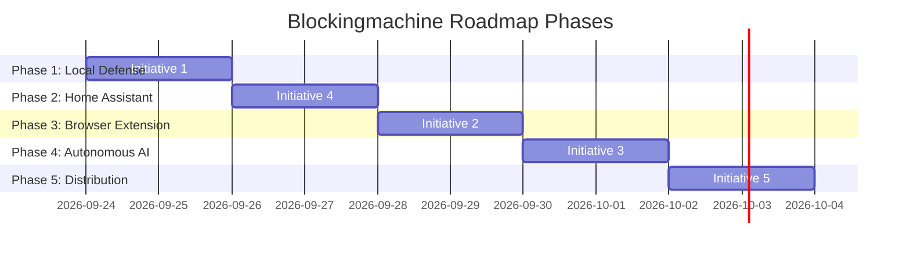

# Blockingmachine Strategic Roadmap & Execution Tracker

**Repository:** `Blockingmachine` Monorepo  
**Last Updated:** September 2026  
**Ecosystem Status:** 27 Test Suites Passing (374/374 Unit Tests) • Zero ESLint Warnings • Manifest V3 Compliant

---

## 🎯 Strategic Overview & Initiative Priority

The user has approved executing all core initiatives, beginning with **Initiative 1 (System DNS Daemon Desktop Integration)**, closely followed by **Initiative 4 (Home Assistant Extension & Custom Integration Ecosystem)** and the remaining high-impact features.

---

## 📋 Comprehensive Execution Checklist

### ✅ Milestone 0: Core Architecture & Boundary Hardening (COMPLETED)
- [x] **Strict DNS vs. Browser Filtering Boundary:** Hardened `filterDNSRules` and `filterBrowserRules` in `@blockingmachine/core`. Zero cosmetic selectors or browser modifiers reach the DNS daemon; zero DNS directives reach the browser extension.
- [x] **Automated MV3 Compliance Guardian:** AST verification script (`scripts/verify-mv3-compliance.mjs`) guarding against `eval`, `new Function`, deprecated APIs, or unverified background contexts.
- [x] **Desktop REST API Layer:** Implemented `/v1/status`, `/v1/compile`, `/v1/check`, and `/v1/telemetry` on port 9191.
- [x] **Dual Sync:** Git repository strictly synced to both `origin` (GitHub) and `forgejo` (`git.greighstudios.com`).

---

### 🚀 Phase 1: Initiative 1 — System DNS Daemon Desktop Integration (IN PROGRESS)
> **Goal:** Provide one-click, zero-latency local DNS adblocking on macOS, Linux, and Windows directly from the Electron app.

- [x] **Daemon Telemetry & Control API (`@blockingmachine/system-daemon`):**
  - [x] Add circular query telemetry buffer and `DaemonStats` counters to `DnsServer`.
  - [x] Add `POST /v1/reload` hot-reloader to re-parse `/dns.txt` without restarting the process.
  - [x] Add `POST /v1/toggle` protection switch (pause/resume blocking).
  - [x] Add `GET /v1/status` and `GET /v1/stats` with CORS support for local dashboards.
- [x] **OS Service & Network Generators (`packages/system-daemon/src/service/`):**
  - [x] macOS `launchd` plist generator (`com.blockingmachine.daemon.plist`) running on port 53.
  - [x] Linux `systemd` unit generator (`blockingmachine.service`) with `CAP_NET_BIND_SERVICE`.
  - [x] Network adapter DNS switching and cache-flush command definitions (`networksetup`, `resolvectl`, `netsh`).
- [ ] **Electron Process Manager & IPC Bridge (`packages/electron-app`):**
  - [ ] Implement `src/daemonManager.ts` in Electron main process to monitor, launch, reload, and toggle the daemon.
  - [ ] Add IPC channels in `preload.ts` (`daemon:getStatus`, `daemon:start`, `daemon:stop`, `daemon:reload`, `daemon:setSystemDns`, `daemon:restoreSystemDns`, `daemon:flushCache`).
  - [ ] Automatically trigger daemon `/v1/reload` whenever compilation completes in the desktop hub.
- [ ] **Deploy Hub UI Integration (`packages/electron-app/src/views/DeployHubView.tsx`):**
  - [ ] Add dedicated **Local System DNS** platform tab.
  - [ ] Status card: Active (Shield Green), Paused (Amber), or Stopped (Gray).
  - [ ] One-click action buttons: "Start Local Protection", "Set as OS DNS", "Restore Default DNS", "Flush DNS Cache".
  - [ ] Live stats ribbon: Queries processed, blocked queries, block rate %, and upstream DoH latency.
  - [ ] OS Service Installation commands drawer (one-click copy for macOS `launchd` & Linux `systemd`).

---

### 🏠 Phase 2: Initiative 4 — Home Assistant Extension & Custom Integration
> **Goal:** Deliver a production-grade, HACS-ready Home Assistant experience with automated CI validation and repository metadata.

- [x] **Scaffolding Completed:**
  - [x] HA OS Add-on (`packages/homeassistant-addon`): Dockerfile, S6-overlay v3, Ingress server, config schema.
  - [x] Custom Integration (`packages/homeassistant-integration`): DataUpdateCoordinator, sensor, binary_sensor, switch, button, services.
  - [x] Deploy Hub Home Assistant Tab: Live test connection, REST API inspector, copyable feed URLs.
- [ ] **Next Steps for Home Assistant Ecosystem:**
  - [ ] **HACS Compliance Setup:**
    - [ ] Create `custom_components/blockingmachine/hacs.json` with categories, minimum HA version, and render style.
    - [ ] Add branding assets (`icon.png`, `logo.png`, `icon@2x.png`).
  - [ ] **Automated Python Pytest Suite:**
    - [ ] Setup `pytest` and `pytest-homeassistant-custom-component`.
    - [ ] Unit tests for `config_flow.py` (user input validation, IP formatting, connection errors).
    - [ ] Unit tests for `coordinator.py` (polling interval, retry backoff, endpoint resilience).
    - [ ] Unit tests for entity state transitions (`sensor.py`, `switch.py`, `button.py`).
  - [ ] **GitHub Action HACS Validator:**
    - [ ] Add `.github/workflows/hacs-validation.yml` running `hacs/action@main`.
  - [ ] **Dedicated Add-on Repository Structure:**
    - [ ] Add `repository.yaml` and standalone installation instructions for one-click Add-on Store install.

---

### 🌐 Phase 3: Initiative 2 — Browser Extension Real-Time Push & Visual Element Picker
> **Goal:** Enable instant rule synchronization from the desktop app to browsers and provide visual point-and-click ad element blocking.

- [ ] **Server-Sent Events (SSE) Live Sync:**
  - [ ] Expose `/v1/events` on the desktop feed server (:9191).
  - [ ] Broadcast `compile_completed`, `rules_updated`, and `quarantine_added`.
  - [ ] Extension background service worker connects via `EventSource` and triggers `syncAndApplyRules()` within < 250ms.
- [ ] **Visual Element Picker (Point-and-Click Cosmetic Blocking):**
  - [ ] Content script element inspection mode with crosshair cursor and bounding highlight box.
  - [ ] Minimal CSS selector generator algorithm.
  - [ ] In-page confirmation card to preview element removal and persist rule into `chrome.storage.local`.
- [ ] **Multi-Store Packaging Automation:**
  - [ ] Create `scripts/package-extension.mjs`.
  - [ ] Package clean `.zip` archives for Chrome Web Store and Firefox AMO.

---

### 🛡️ Phase 4: Initiative 3 — AI Threat Quarantine Dynamic Feeds
> **Goal:** Materialize AI Radar detections into live, auto-updating blocklists for all network devices.

- [ ] **Dynamic Threat Feed Endpoints:**
  - [ ] Expose `/ai-threats.txt` (domain format) and `/threats.txt` (ABP format) on port 9191.
  - [ ] Include active high-confidence ($\ge 85\%$) quarantined domains from AI Radar.
- [ ] **Autonomous Watchdog Quarantine Pipeline:**
  - [ ] Add setting: "Auto-quarantine zero-day DGA / high-entropy domains".
  - [ ] Auto-inject quarantined items into active local DNS trie memory.

---

### 📦 Phase 5: Initiative 5 — Cross-Platform Release Packaging
> **Goal:** Automate release binaries for macOS (DMG/Zip), Windows (NSIS/exe), and Linux (deb/AppImage).

- [ ] **Electron Forge Configuration:**
  - [ ] Add makers for Windows (`@electron-forge/maker-squirrel` / zip) and Linux (`@electron-forge/maker-deb`, `@electron-forge/maker-rpm`).
- [ ] **Automated GitHub Release Action (`publish.yml`):**
  - [ ] Trigger on tag `v*` to build, sign, and draft releases with downloadable assets.

---

## 📌 Implementation Conventions
1. **Design First:** Always outline data flow and schema before editing code.
2. **Quality Gates:** 100% test pass rate across all suites; zero ESLint warnings or errors.
3. **Dual Git Remote Invariant:** All commits must push to both `origin` (GitHub) and `forgejo` (`git.greighstudios.com`).
