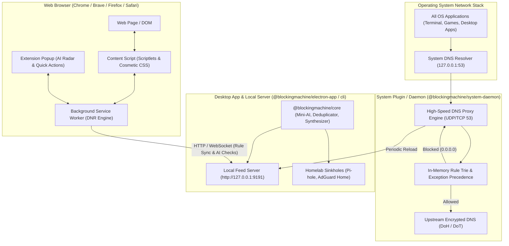

# Blockingmachine: Browser Extension & System Plugin Design Specification

This document details the architectural design, data pipelines, IPC protocols, and implementation blueprint for two new endpoint defense components in the Blockingmachine monorepo:
1. **Browser Extension (`@blockingmachine/browser-extension`)**: Modern Manifest V3 WebExtension providing in-tab cosmetic filtering, procedural scriptlet injection, network request filtering (`declarativeNetRequest`), and a live AI Radar popup.
2. **System Plugin / Native DNS Daemon (`@blockingmachine/system-daemon`)**: Lightweight, high-throughput loopback DNS resolver and system-level filtering daemon providing OS-wide protection across non-browser applications.

---

## 1. High-Level System Architecture



---

## 2. Component 1: Browser Extension (`@blockingmachine/browser-extension`)

### 2.1 Scope & Capabilities
1. **Declarative Network Filtering (`declarativeNetRequest`)**:
   - Converts standard network blocking rules (`||domain^$options`) into dynamic Chromium/Firefox DNR rule batches.
   - Operates with native C++ browser speed without JavaScript thread blocking.
2. **Procedural Scriptlet Injection (`world: "MAIN"`)**:
   - Injects anti-adblock defusers (`set`, `abort-on-property-read`, `prevent-addEventListener`, `google-funding-choices`) before target web scripts execute.
   - Neutralizes anti-adblock walls (Admiral, Ezoic, Snigel, PageFair).
3. **Cosmetic Element Hiding**:
   - Injects CSS stylesheets dynamically based on current host (`##.ad-banner`, `###cookie-consent`).
4. **Live In-Tab AI Radar Popup**:
   - Shows total blocked requests, third-party domain breakdown, lexical Shannon entropy score, CNAME cloaking warnings, and 1-click **"Block Host"** / **"Whitelist Domain (`@@`)"**.
5. **Bi-Directional Desktop Sync**:
   - Polls or connects via WebSocket to `http://localhost:9191` to receive instant rule updates whenever compilation runs in the Desktop app.

### 2.2 Directory Layout
```
packages/browser-extension/
├── manifest.json                  # Manifest V3 specification
├── package.json                   # Workspace metadata & dependencies
├── tsconfig.json                  # TypeScript compiler options
├── webpack.config.cjs             # Multi-entry bundler (background, content, popup)
├── src/
│   ├── background/
│   │   ├── index.ts               # Background Service Worker entry
│   │   ├── dnrManager.ts          # DeclarativeNetRequest rule compiler & updater
│   │   ├── syncClient.ts          # Local Feed Server polling / WebSocket client
│   │   └── telemetry.ts           # Per-tab request and block counter state
│   ├── content/
│   │   ├── index.ts               # Content Script bridge (isolated world)
│   │   ├── scriptletInjector.ts   # Injects procedural scriptlets into main world
│   │   └── cosmeticHider.ts       # Injects and manages element hiding stylesheets
│   ├── popup/
│   │   ├── index.html             # Popup UI entry
│   │   ├── index.tsx              # React / Vanilla UI root
│   │   ├── PopupApp.tsx           # Live radar, tracker list, entropy meter
│   │   └── popup.css              # Dark-mode glassmorphic styling
│   └── shared/
│       ├── types.ts               # Message protocol between popup, CS, and worker
│       └── constants.ts           # Ports, default feeds, and storage keys
└── assets/
    └── icons/                     # 16px, 32px, 48px, 128px PNG icons
```

---

## 3. Component 2: System Plugin / DNS Proxy Daemon (`@blockingmachine/system-daemon`)

### 3.1 Scope & Capabilities
1. **Local DNS Listener**:
   - Binds to `127.0.0.1:53` (or customizable port/interface) handling UDP and TCP DNS queries.
2. **Zero-Latency In-Memory Rule Evaluation**:
   - Leverages a domain suffix Trie matching millions of host rules in microseconds.
   - Enforces Blockingmachine rule precedence: **Exceptions (`@@`) override Blocks**, **`$important` exceptions override `$important` blocks**.
3. **Upstream Forwarding & DNS-over-HTTPS (DoH)**:
   - Forwards allowed queries to upstream encrypted DNS resolvers (Cloudflare, Quad9, AdGuard DNS, or local Pi-hole).
4. **Loopback Sinkhole**:
   - Returns `0.0.0.0` (for A) and `::` (for AAAA) with TTL 60 for blocked domains.
5. **Control API & IPC**:
   - Lightweight Unix Domain Socket or HTTP localhost API (`127.0.0.1:9292`) for status checks, live query streams, and instant cache invalidation.

### 3.2 Directory Layout
```
packages/system-daemon/
├── package.json                   # Workspace metadata
├── tsconfig.json                  # Node.js target config
├── bin/
│   └── blockingmachine-daemon.js  # CLI executable wrapper
├── src/
│   ├── index.ts                   # Daemon startup and lifecycle management
│   ├── server/
│   │   ├── dnsServer.ts           # UDP / TCP DNS protocol handler (port 53)
│   │   ├── dohForwarder.ts        # Encrypted DNS-over-HTTPS upstream client
│   │   └── controlApi.ts          # Local IPC / REST endpoint (status, reload)
│   ├── engine/
│   │   ├── domainTrie.ts          # Fast prefix/suffix tree for O(k) rule lookup
│   │   ├── ruleLoader.ts          # Ingests compiled output from core or localhost
│   │   └── cache.ts               # Memory-bounded LRU DNS response cache
│   ├── config/
│   │   └── daemonConfig.ts        # Ports, upstream servers, fallback modes
│   └── types.ts                   # DNS message and packet types
```

---

## 4. Shared Monorepo Integration

Both new packages link directly to `@blockingmachine/core` in the monorepo:
- `packages/browser-extension` imports parsing, types, and heuristic entropy formulas from `@blockingmachine/core`.
- `packages/system-daemon` imports `RuleProcessor`, `RuleDeduplicator`, and `evaluateDomainRules` from `@blockingmachine/core`.
- Monorepo root `package.json` manages both workspaces cleanly with shared TypeScript, linting, and build targets.
